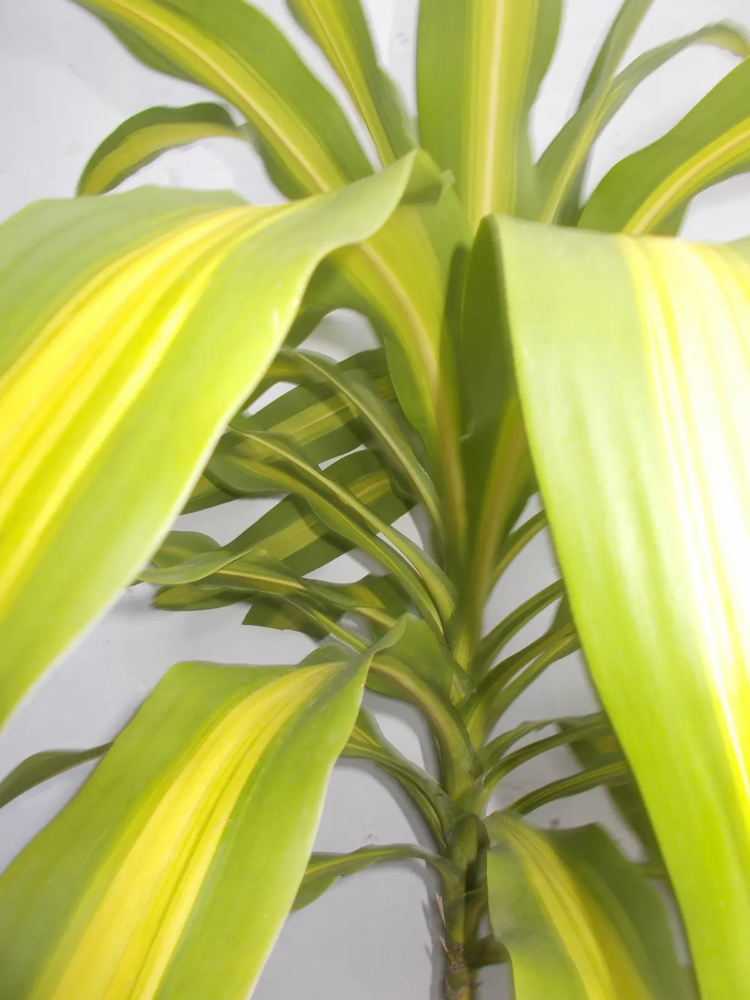

## Meet Rachel

:::::: {style="display: grid; grid-template-columns: 280px 1fr; gap: 2rem; align-items: center;"}

{style="width: 100%;"}

I'm a writer, a grower, and a firm believer that the way we keep our homes, tend our gardens, and dress ourselves says everything about how we choose to live.

My path has been anything but straight, and I wouldn't have it any other way. Over the years I've worn many hats: teacher, copywriter, editor, and researcher. What connects them all is a love of learning, a sharp eye for detail, and a deep commitment to getting things right. When I recommend something on Rachel Living, you can trust that it's been thought through.

::::::

**From my Parents' Farm to my Backyard**

:::::: {style="display: grid; grid-template-columns: 1fr 300px; gap: 1.5rem; align-items: start;"}

Agriculture is in my blood. I grew up the daughter of part-time farmers who never lost their connection to the soil. Under their guidance, I learned the rhythms of the earth and the fundamentals of nurturing healthy plants.

Today my sanctuary is a thriving container garden of Aloe veras, snake plants, and a towering corn plant, with container vegetables coming soon. Whether you have acres of land or just a few pots on a patio, I'm here to help you grow.

::: {style="height: 250px; overflow: hidden;"}
{style="width: 100%; height: 100%; object-fit: cover;"}
:::

*A peak at my Corn Plant*

::::::

**Style with Substance**

Beyond the garden, fashion and clean living are ways of life for me. I'm particularly drawn to the architectural beauty of earth buildings, the science of non-toxic cleaning solutions, and the timelessness of sustainable style.

I test the tools, review the fabrics, and vet the eco-innovations so you can build a life that is as intentional as it is beautiful.

## What Rachel Living Is About

This blog exists at the intersection of beauty, utility, and sustainability. My goal is simple: to cut through the noise and share only what genuinely works for a conscious, grounded lifestyle.

Every guide, review, and recommendation here is researched with the same rigour I've brought to everything I've done because you deserve honest, well-considered advice, not just another list of sponsored products.

## Find Me On

::: {style="display: flex; gap: 3rem; font-family: 'Helvetica Neue', Arial, sans-serif; font-size: 14px;"}
<a href="https://pinterest.com/rachelliving_" target="_blank" style="color: #7D8C6A;">📌 Pinterest</a>
<a href="https://youtube.com/@rachelliving" target="_blank" style="color: #7D8C6A;">▶️ YouTube</a>
:::

## Work With Me

Rachel Living is open to collaborations with brands that share a genuine commitment to sustainability, quality, and conscious living. If that sounds like you, I'd love to hear from you.

📩 *\[Your email address here\]*
