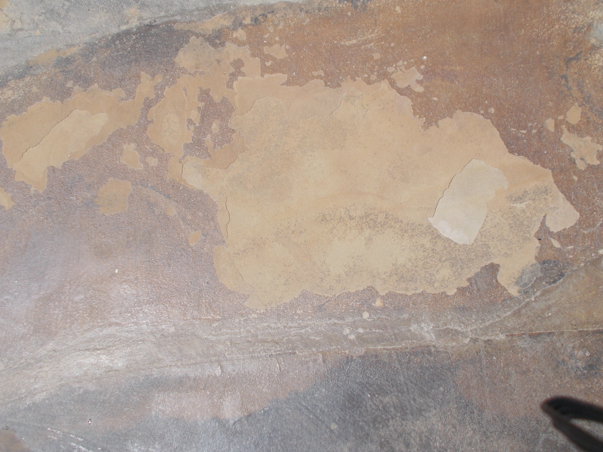
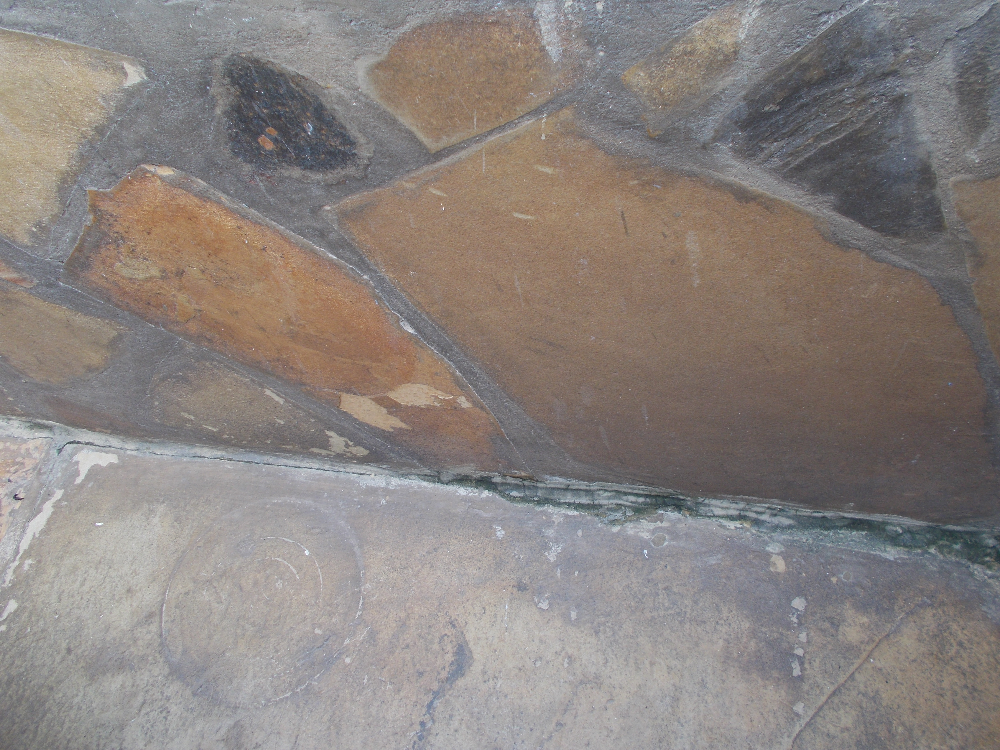

::: {.callout-note}
### Affiliate Disclosure
As an Amazon Associate, I earn a small commission if you buy the Foundation Armor SX5000 WB Clear/Matte Sealer through the Amazon link in this article. All other local Kenyan product links listed are non-affiliate links.
:::

I was super excited when we installed Galana stones in our small (6 m by 4 m) driveway. We'd just bought a small mid-terrace house at the Kenyan coast and were sprucing it up to make it more liveable. 
I'm a stubborn barefooter, so I couldn't wait to experience walking on the stones. Also, as we were working on a tight budget, it was a relief to find an affordable, eco-friendly flooring solution for our outdoor space to contrast the ceramic tiles inside.

Galana stones, also known as Mazeras stones, are a type of natural sandstone rich in quartz and iron oxides, which give them their famous, rich earthy coloring. They are often mined as layered sheets, which are then split into slabs for flooring or wall cladding.

I can't say we were blind to the drainage issues in our driveway when we decided to install the stones. Two of my neighbors had extended their properties and altered their gutters to empty onto my driveway, significantly increasing the amount of rainwater falling my way (the nerve, right!). We'd installed a downpipe and a tank to collect this water, but quite a lot of it still flowed out. 

We discussed this issue with the mason we contracted to do the work, and they tried to remedy it by grading the driveway to channel the runoff away from the house. They also recommended sealing the stone with an appropriate sealer to protect it from the excessive water. A local painter recommended using [Crown Transeal Acrylic Clear Finish](https://www.crownpaints.co.ke/product/crown-transeal-acrylic-clear-finish/){target="_blank"}. We should have read up on the product because it was the wrong sealer to use. In fact, its manufacturers clearly state this on its description page: "Transeal is designed for interior use and should not be applied to exterior surfaces subjected to strong sunlight." Grrr, how foolish could we be!

## Sun and Rain

It didn't take long for us to realize our mistake. A few months down the line and the seal was blistering and peeling almost everywhere. You see, the Transeal had formed an almost plastic layer on top of the stone, trapping moisture that rose from the ground beneath the driveway. Heated by the scorching coastal sun, the trapped moisture expanded putting pressure on the stone underneath the seal and forcing the top layers of our precious stone to pop and crack. Anytime something heavy, like a car, rolled over the driveway, the stone cracked some more.

{fig-cap="Cracks on Our Galana"}

We also noticed that algae and black mold were beginning to grow in a few unsealed corners, particularly where the walls met the floor. The gentle slope in the driveway helped drain a lot of rainwater, but some water still pooled in the areas with cracks. I think it helped some that I cleaned and dried the driveway daily, rain or no rain, as the mold didn't spread beyond those joints.   

{fig-cap="*Mold on Floor-Wall Joint*"}

## The Cleaning Process

Because of other commitments, we were able to resolve the problem almost two years later. By then, much of the acrylic sealer had peeled away on its own. Our mason used medium-grit sandpaper to clean remnant sealer and smoothen bumps and cracks without gouging the stone. Although professional stone restorers may recommend other approaches for large projects, this approach worked for us because it was affordable, locally available, and effective for our small driveway. 

Next, we scrubbed off the algae and mold using a stiff brush, hot water, and a mild dishwashing solution. Because our stone is a natural sandstone containing iron oxides and other minerals, we chose to avoid harsher cleaners like bleach and vinegar and opted for a gentler solution.

Finally, we scrubbed the entire driveway with a stiff brush using warm water and a mild dishwashing solution. After rinsing it thoroughly several times with clean water, we left the stone to dry for a few days before resealing it. 

## Resealing the Driveway

For resealing, we went with [Crown Silicone Clear Sealer](https://staging.crownpaints.co.ke/product/crown-silicone-clear-sealer-wb){target="_blank"}, a breathable, water-based, penetrating sealer. Unlike the acrylic sealer we'd used before, this sealer was designed to penetrate the stone rather than form a plastic-like layer on top. We wanted something that would allow our stone to breathe while helping protect it from stains, mold, and the strong coastal sun.

Before sealing, we inspected the driveway to see if any additional repairs were needed. Apart from a little dust, it looked quite good. We gave it one final clean using a soft, lint-free mop and clean water. We chose a sunny day with no rain in the forecast to give the sealer enough time to cure properly. We did the cleaning early in the morning, and by early afternoon the stone was completely dry.

We then applied the first coat of sealer and waited three hours before applying the second coat, following the manufacturer's instructions. 

The results were pure gold! I'll share some before-and-after photos soon.

## What We Learned

1. **Sandstone needs to breathe**

   We learned the hard way that sandstone needs to breathe. By using a film-forming sealer, we likely trapped moisture beneath the surface, which contributed to pealing and cracking over time. 

2. **Take care to read the manufacturer's instructions yourself**

   We'd have saved ourselves a lot of trouble if we'd verified the verbal recommendation instead of relying on it completely. All we had to do was look up technical information on the sealer from the manufacturer's website before making a decision.

3. **Maintenance is key**

   Even with a great sealer, you shouldn't let water sit on your sandstone. Cleaning it regularly with the right agents can prevent many problems from becoming expensive repairs.  

4. **Drainage matters more than you think**

   We're actually thinking of doing more to improve the drainage situation on our driveway, even though the grading has helped a lot over the years. One solution we've considered is installing a larger storage tank and pairing it with an automatic downspout diverter. That way, once the tank is full, the system will naturally channel the excess water away from the driveway. We've been looking at some DIY videos online and think the idea is practical, but implementing it is taking us more time than we'd like (sigh!).

## Products I'd Consider Today

The products we used were sourced locally in Kenya and may not be available to users elsewhere. 
Based on my experience, if I were to do the project afresh, I'd look for the following products:

- **Breathable penetrating stone sealers:** A good penetrating sealer protects the stone while still allowing moisture vapor to escape. 

  One option I'd consider if I were looking for an internationally available product is **Foundation Armor SX5000 WB Clear/Matte Sealer**, a water-based penetrating sealer that is designed to provide a natural finish similar to the look I wanted for my driveway. 

  Check current price and availability: [Foundation Armor SX5000 WB Clear/Matte Sealer](https://amzn.to/4fVDlTg){target="_blank"}. 

  **Recommended research:** Best Penetrating Sealers for Outdoor Sandstone in Humid Climates

- **Stone-safe mold and algae cleaners:** Not all mold and algae removers are appropriate for natural stone.

  **Recommended Research:** Best Mold and Algae Cleaners for Natural Stone

- **Suitable cleaning and maintenance tools:** Maintaining natural stone is much easier when you have the right tools.

  **Recommended Research:** Best Tools for Cleaning and Maintaining Outdoor Stone Surfaces

