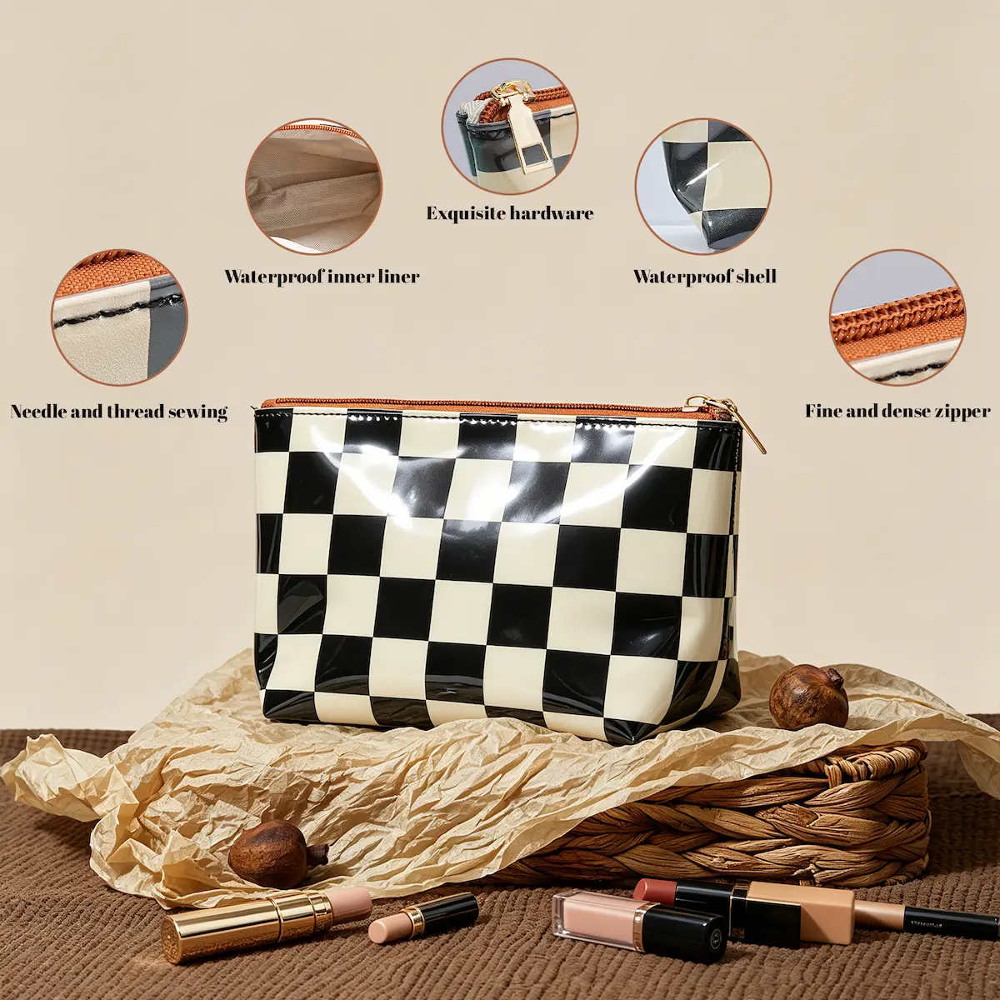
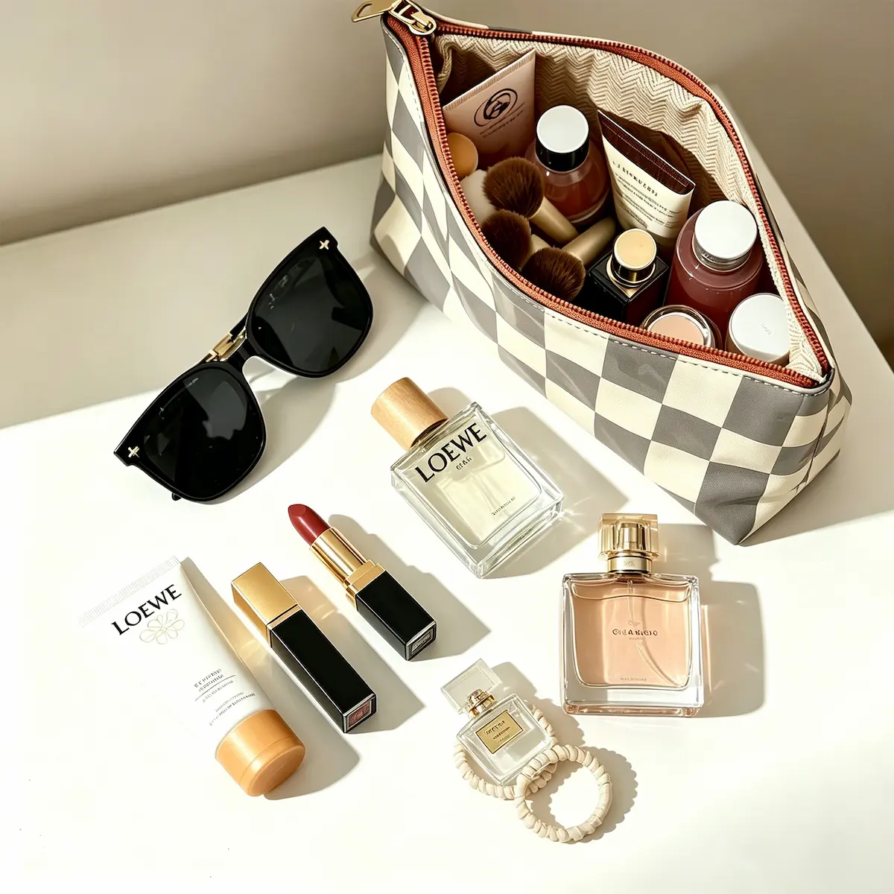

::: callout-note
### Affiliate Disclosure

As an Amazon Associate, I earn from qualifying purchases. This article also contains affiliate links to other retailers, including AliExpress. If you make a purchase through any of these links, I may receive a small commission at no extra cost to you. I only recommend products I genuinely believe add value to my readers.
:::

Several years ago, two beautiful PU leather wallets I bought from Woolworths taught me an expensive lesson about living on Kenya's humid coast. After they grew mold, peeled, and cracked far sooner than I expected, I started looking for a practical alternative. A PVC makeup pouch from the same store turned out to be exactly what I needed. I shared that experience in [Why I Ditched My Premium PU Leather Wallets for a Cheaper PVC Pouch](why-i-ditched-my-premium-pu-leather-wallets-for-a-cheaper-pvc-pouch.qmd){target="_blank"}, and one question naturally followed: What if I can't buy the same pouch?

That question sent me searching for alternatives. Because my own **W Beauty pouch** is still going strong, I wasn't shopping for a replacement for myself. I was looking for options I could recommend to readers who can't easily buy the same Woolworths pouch.

One thing surprised me during that search: finding the kind of PVC leather pouch I was looking for wasn't nearly as straightforward as I expected. Amazon and AliExpress were full of clear PVC toiletry and cosmetic bags, like this [mini coin purse and cosmetic bag (#ad)](/go/clear-pvc-coin-purse){target="_blank"} from AliExpress. Cute? Absolutely. But they didn't quite capture the opaque wallet look I had in mind. The designs I sought often appeared under different labels, like *vegan leather*, *faux leather*, or *patent leather*, or simply weren't available anymore, like this [glittery Kate Spade pouch (#ad)](https://amzn.to/4eNBejp){target="_blank"} I came across on Amazon.

After a lot of searching, I finally settled on five makeup pouches I'd genuinely consider if I ever needed to replace my own. Each one offers a practical take on the same idea that won me over in the first place: using a simple PVC makeup pouch as an everyday wallet.

I've included products from both Amazon and AliExpress. Where a product ships from AliExpress, expect delivery to take a little longer than Amazon in most cases.

## If You Like a Classic Black Look

The first pouch that caught my attention was this [BBORGDC Small Cosmetic Bag Set of 3 (#ad)](/go/bborgdc-cosmetic-bag){target="_blank"} from Amazon. At first glance, it reminded me of what I liked about my own **W Beauty pouch**: a simple black design that doesn't immediately look like a makeup bag. If you're planning to use a cosmetic pouch as an everyday wallet, I think that's a nice quality to have.

I like that it comes as a set of three different sizes. You could use the smallest as an everyday wallet and still have the others for travel or organizing small items in your bag.

The listing also includes versions made from other materials, like corduroy and patterned cotton. If you're specifically looking for PVC, double-check that you've selected the correct option before placing your order.

## If You Want Something With a Bit More Personality

Not everyone wants a black wallet that quietly blends in the background. This [Insect Atlas PVC Leather Makeup Bag by STejar (#ad)](/go/insect-atlas-pvc-bag){target="_blank"} caught my eye because of its bold insect print, which gives it far more personality than the plain black pouches I'd been looking at. It is also slightly bigger, about half an inch longer than the largest **BBORGDC pouch**. Like the BBORGDC set, it features a zippered closure, interior compartments, and a compact design that's easy to carry.

It can also be repurposed as an everyday wallet. Its interior compartments should make it easier to keep cash, cards, keys, and other small essentials, while its roomy design could make it a practical clutch-style wallet for travel or for anyone who likes carrying a little more than the basics.

## If You Like a Glossy Finish

::: {layout-ncol="2"}
{width="60%"}

{width="60%"}
:::

::: {.grid-caption}
The Ovwqt checkered bag
:::

When I came across the [Ovwqt checkered bag (#ad)](/go/ovwqt-checkered-bag){target="_blank"}, I knew I had to add it to this roundup. It combines the same practical PVC exterior that first won me over with a glossy finish that complements its black-and-cream checkerboard design, giving it a look that feels both playful and classic.

Although it's not as spacious as the **Insect Atlas**, it still has enough room for cards, cash, keys, and other small personal items. Unlike some of the other pouches in this roundup, it doesn't have interior compartments, so everything shares the same main storage space. If you already prefer carrying a simple pouch rather than a traditional wallet, that probably won't feel like much of a compromise.

## If You're Happy to Spend a Little More

This [Stoney Clover Lane Small Pouch (#ad)](/go/stoney-clover-lane-pouch){target="_blank"} is easily the most expensive pouch in my roundup, but I included it because its clean design and PVC exterior reminded me that practical doesn't always have to mean inexpensive.

I especially love the pouch's gold finish, which gives it a dressier look than the other options in this roundup. It could easily double as a small clutch for weddings, dinners, or other special occasions. Another version features a clear iridescent finish with a gold zipper pull, offering a different take on the same polished, fashion-forward style.

## If You Want the Closest Match to Mine

Of all the pouches I came across, this [Delfonics Quitterie Pouch](/go/delfonics-quitterie-pouch){target="_blank"} probably reminds me most of the **W Beauty pouch** I've been using for the past two years. It has the same understated feel: an opaque PVC exterior, a clean silhouette, and a textured finish that gives it a little more character than a completely smooth pouch.

Its slim profile makes it better suited to flat everyday essentials like cards, small makeup compacts, coins, charging cables, or earbuds. I especially like the black, butter yellow, and white versions, although several other colors are available too.

## A Quick Note on Caring for PVC Pouches

One thing I learned while researching these pouches is that PVC has its own strengths and weaknesses. While it generally copes with humid conditions better than PU leather, it doesn't appreciate prolonged exposure to strong sunlight or excessive heat.

My own W Beauty pouch has held up well for more than two years. I suspect one reason is that I keep it inside my handbag during the day and store it on a shaded shelf at home. Those habits may have helped extend its life.

If you choose one of the pouches in this roundup, a little care can go a long way. Keeping it out of direct sunlight when you're not using it, avoiding excessive heat, and wiping it clean occasionally should help keep it looking its best for longer.
