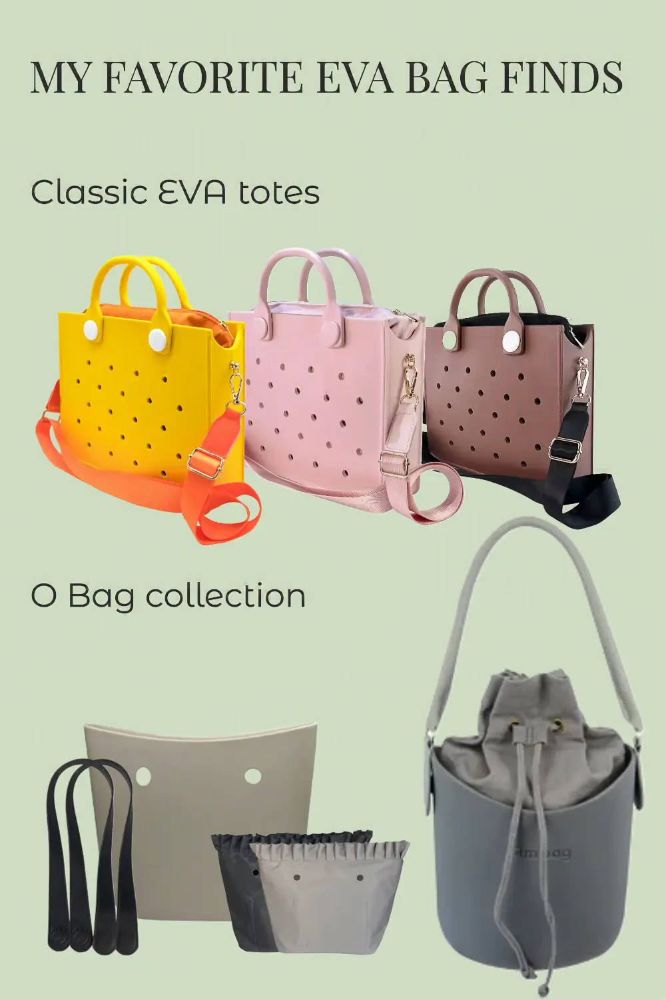

::: callout-note
### Affiliate Disclosure

This article contains affiliate links. If you purchase a product through one of these links, I may earn a small commission at no extra cost to you. The bags featured here are shopping finds that caught my eye while browsing AliExpress. Unless otherwise stated, they are not products I have personally purchased or tested.
:::

{width="50%" fig-align="center" fig-alt="My favorite EVA bag finds on AliExpress"}

## A Few EVA Bags That Caught My Eye

I was browsing AliExpress a few days ago, looking for bags that might hold up better in my hot and humid coastal climate. I was pleasantly surprised to come across bags made from a rubber-like material similar to what's used in Crocs footwear. My first thought was, "Now we're on to something!"

That's how I discovered EVA bags. While shopping online, it's easy to mistake them for silicone bags because they look so similar, and some sellers even use the terms interchangeably. I'll save that comparison for another day. For now, here are the EVA bags that made me stop scrolling.

## Classic EVA Totes

### Shoulder Bag from Cute Gift Store

This [Cute Gift Store shoulder bag (#ad)](/go/cgs-shoulder-bag){target="_blank"} comes in a wide range of fun colors, alongside all-black and all-pink versions for a more understated look.

The bag's body is made from waterproof EVA with tiny perforations, while the canvas-lined interior features a zipper closure to help keep your belongings secure. It looks like a versatile bag that could work just as well for shopping, casual outings, or a trip to the beach.

## O Bag Collection

### DIY Mini Size O Bag from Unetome CC Store

The [Unetome DIY Mini Size O Bag (#ad)](/go/unetome-mini-obag){target="_blank"} is designed to let you customize the handles and lining to suit your style.

This listing includes only the EVA shell, but Unetome also offers a range of compatible handles and liners. For the combination shown in the pin above, I picked [these black handles (#ad)](/go/unetome-black-handles){target="_blank"} and [these liners (#ad)](/go/unetome-liners){target="_blank"}. Of course, there are many other combinations to choose from.

### Ambag Basket Bag from Small Cute Store

If you'd rather skip choosing separate parts, this [fully assembled O Bag (#ad)](/go/fully-assembled-obag){target="_blank"} comes ready to use with a matching handle and inner bag. Its structured bucket-shaped EVA body gives it a clean, polished look that could work well with both casual and dressier outfits.

It's also available in a range of color combinations, each paired with coordinated handles and an inner bag.

## Final Thoughts

These are some of the EVA bags that caught my attention while browsing AliExpress. For this shopping trip, I focused on average-sized bags for hot, humid days, and I found far more interesting designs than I could mention here.

Next time, I'll explore smaller EVA pouches or bigger EVA shopping bags. Until then, see ya!
