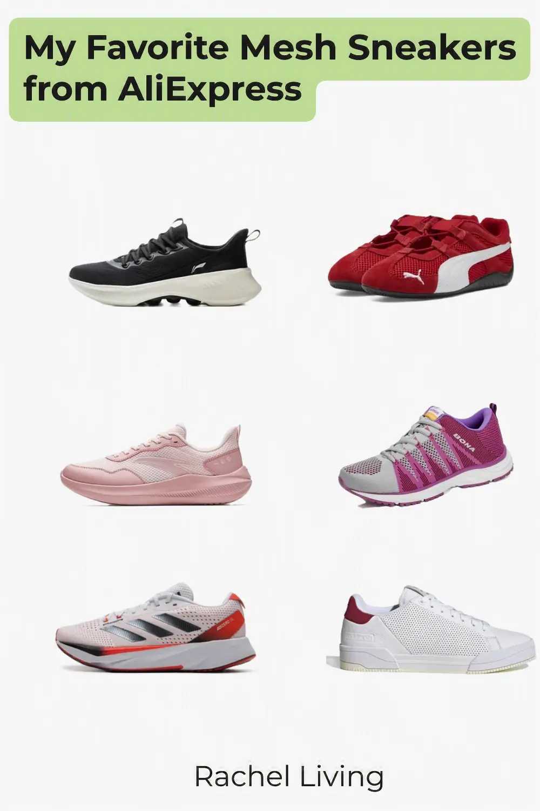
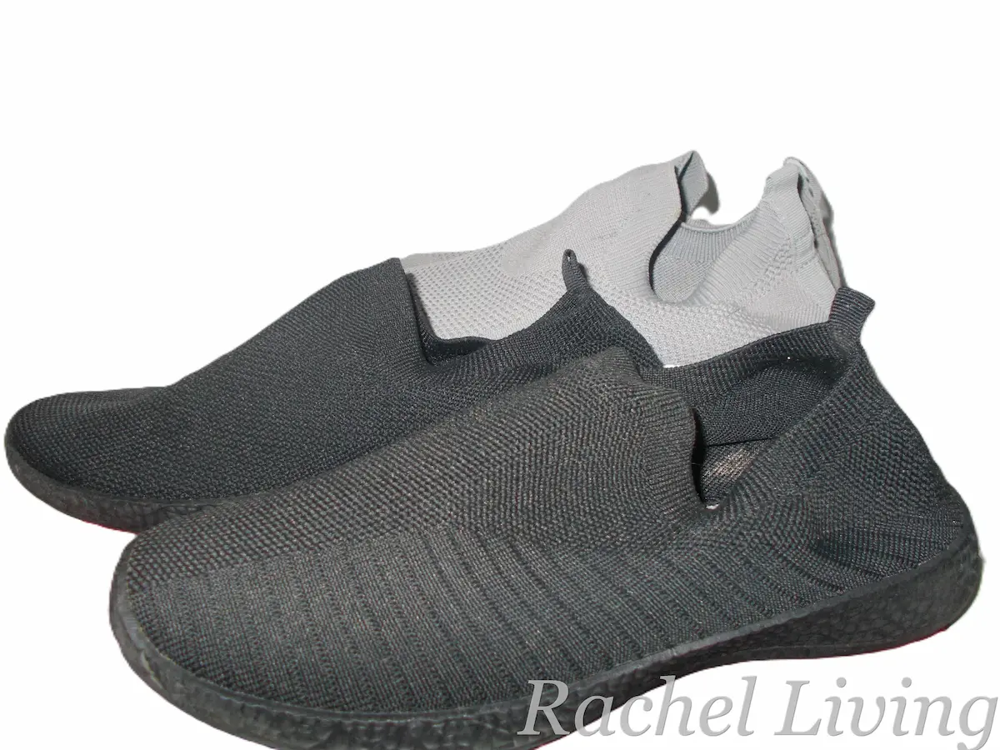

::: callout-note
### Affiliate Disclosure

This article contains affiliate links. If you purchase a product through one of these links, I may earn a small commission at no extra cost to you. The sneakers featured here are shopping finds that caught my eye while browsing AliExpress. Unless otherwise stated, they are not products I have personally purchased or tested.
:::

{width="50%" fig-align="center" fig-alt="My favorite Mesh Sneakers from AliExpress"}

A couple of years ago, I bought two mesh sneakers from Woolworths. They've held up remarkably well over the years, showing very little signs of wear. You can see them below.

{width="60%"}

Yesterday, I decided to browse AliExpress to see what mesh sneaker styles 2026 has to offer, and I was impressed! Here are the six styles I'd happily choose this year.

## Li-Ning SOFT ESSENTIAL V2 Casual Sneakers

These [women's mesh sneakers (#ad)](/go/li-ning-v2-casual-sneakers){target="_blank"} caught my eye with their clean, sporty design. At first glance, they look like ordinary lace-up sneakers, but they're actually slip-ons. The laces seem to be there for decoration, though I'm curious whether they can be adjusted for a snugger fit. As you'd expect from mesh sneakers, the uppers look nice and breathable. The soles also look fairly chunky. I'd estimate a stack height of around 5 cm, which makes me think they'd provide plenty of cushioning for everyday walking.

## Puma SPEEDCAT Ballet Racing Shoes

These [red women's sneakers from Puma (#ad)](/go/puma-speedcat-racing-shoes){target="_blank"} are among the most expensive in this roundup. Even though I was looking for budget-friendly options, I couldn't resist including them because of their color and soles. Now, which one should I talk about first? The soles, of course! I happen to like this kind of minimalist, low-profile sole. It reminds me a little of barefoot shoes, although those are designed with wider toe boxes and other features for natural walking. From what I've read, this style of sneaker isn't really meant for long walks because the thin soles don't provide much cushioning. Instead, I'd see it as a stylish choice for casual outings or even as a driving shoe. And then there's that striking red finish. It gives the sneaker plenty of personality and makes it hard to miss.

## ANTA QINGKONG Running Shoes

Another expensive pair in this roundup is these [ANTA mesh running shoes (#ad)](/go/anta-qingkong-sneakers){target="_blank"}. I decided to include them because they're unisex, have breathable mesh uppers, and feature a thick, rockered sole that looks like it'd cushion your feet well and make long walks feel more comfortable. I'd happily wear them for casual jogging or a day of walking around the city. Did I mention they come in several colors? The pink pair is my favorite, but there's also an all-black version and a grey one that look just as good.

## BONA Lace-up Athletic Shoes

Here are a few things I like about these [BONA athletic shoes for women (#ad)](/go/bona-laceup-shoes){target="_blank"}. First, the soles look like they'd strike a nice balance. They're neither too chunky nor too low, which makes me think they'd be comfortable for everyday wear. I also love the vibrant purple accents. They add a playful touch that really appeals to me. And, of course, there's the breathable air mesh upper and the lace-up design, which should make it easier to adjust the fit to your liking.

## Adidas ADIZERO SL Running Shoes

Although slightly pricey, these [Adidas ADIZERO SL (#ad)](/go/adidas-adizero-shoes){target="_blank"} look like the kind of sneakers that could replace the need for owning several pairs. Their sleek, sporty design makes them versatile enough to wear for a morning run, a gym workout, or even a casual shopping trip later in the day without looking out of place. They also have beathable mesh uppers along with medium-height, slightly rockered soles that look like they'd provide plenty of cushioning. Best of all, they're designed as a unisex shoe, so they're suitable for both men and women.

## Adidas GX4347 Mesh Sneakers

I was pleasantly surprised to discover that Adidas has quite a few affordable mesh sneakers on AliExpress, but I only had room for one more in this roundup. I chose these [Adidas GX4347 mesh sneakers](/go/adidas-gx4347-sneakers){target="_blank"} because of their clean, white-and-red, minimalist design. I can easily picture myself wearing them with jeans or chinos for a crisp, casual look. Unlike the ANTA sneakers or the Adidas ADIZERO SL earlier in this roundup, these have a flat, cup-style sole rather than a rockered one. That makes me think they'd be better suited to casual outings or gym workouts on flat indoor surfaces.

## Final Thoughts

Those are my six favorite mesh sneaker finds from AliExpress this year. I enjoyed putting this list together, and I hope it helps you find a comfortable pair that suits your style and budget. Happy shopping, and see you soon!
