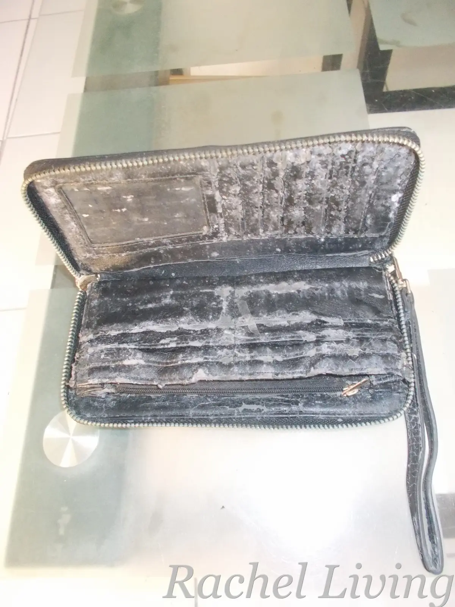
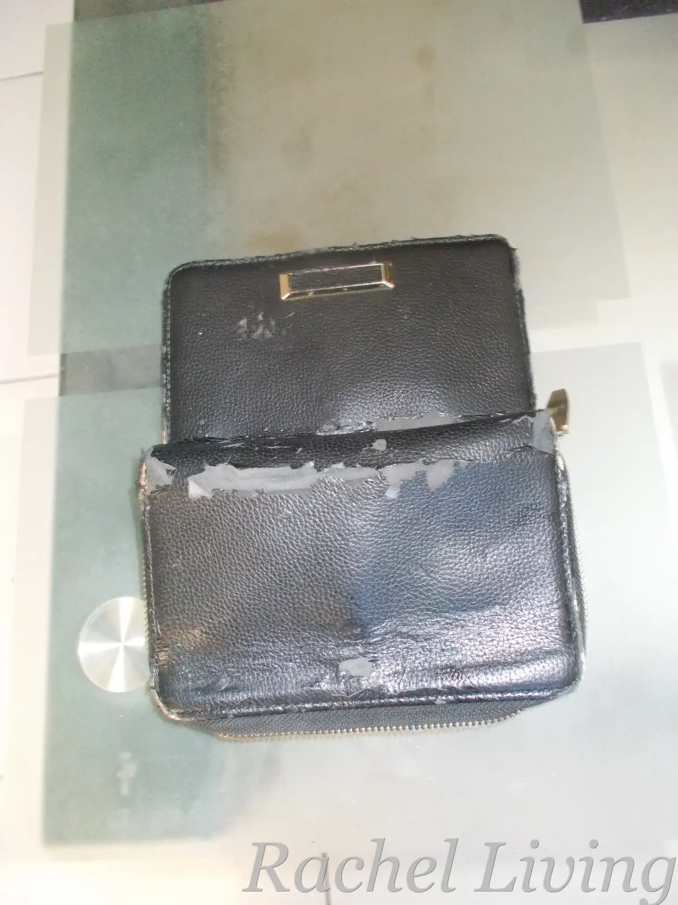
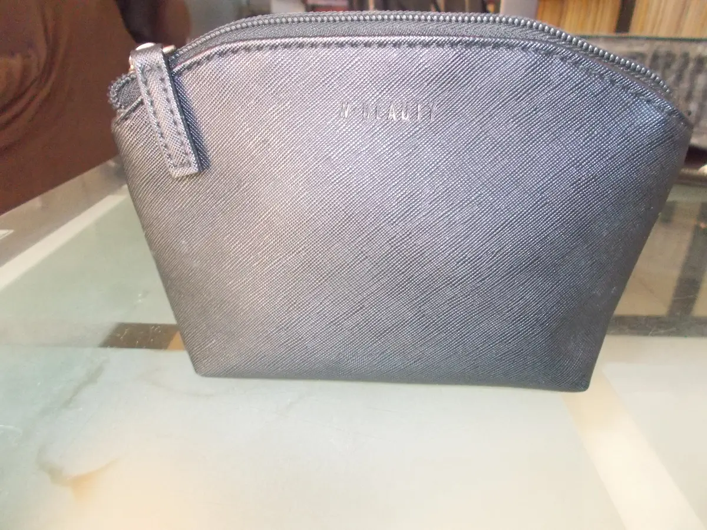

::: callout-note
### Affiliate Disclosure

As an Amazon Associate, I earn from qualifying purchases. This article also contains affiliate links to AliExpress. If you make a purchase through any of these links, I may receive a small commission at no extra cost to you. I only recommend products I genuinely believe add value to my readers.
:::

## I Thought I Was Buying Something That Would Last

Five to ten years ago, I was doing a lot of traveling. I'd moved from two sultry cities in Southeast Asia to a cold town in Africa before finally settling for a time in Kikambala, Kenya, right on the Indian Ocean coast. Living in a tropical oceanic climate taught me things about everyday life that I'd never have learned otherwise. One of those lessons came from something as ordinary as a wallet.

One day, needing a new wallet, I wandered into an upscale clothing and lifestyle store called Woolworths. I picked out two trendy black wallets because, well, I love black. C'mon, who doesn't? I didn't even bother reading the labels. They looked great, and that was good enough for me.

I keep all my bags on an open shelf in my closet. At some point, I must have pushed the wallets toward the back and forgotten about them.

That turned out to be a very expensive mistake.

## Then My Wallets Started Growing Something I Never Bought

The next time I reached out for my wallets, I had to do a double take. Instead of the sleek black finish I'd fallen in love with, they were covered in patches of ugly white mold. Assuming it was a one-off contamination, I cleaned them with a vinegar-and-warm-water solution and hung them out in the sun to dry, which, as it turns out, was another mistake.

Looking back, I probably should have read the labels before buying them. Then I'd have known my precious wallets were made from polyurethane (PU) leather, a synthetic material made by coating a fabric backing with polyurethane. I might even have stored and cared for them differently, and perhaps they would have lasted a little longer.

The next time I pulled the wallets out of storage, the mold was back. The material was also peeling and cracking, and the wallets looked far older than they should have after only two years. I'd never seen anything like it.

::: {layout-ncol="2"}
{width="60%"}

{width="60%"}
:::

::: {.grid-caption}
My PU leather wallets
:::

That was when I finally checked the labels. They read, "100% PU; Lining: 100% Polyester." I ended up researching what PU leather actually was and how it behaves in humid environments.

Turns out, PU leather and Kikambala's humidity weren't exactly best friends.

## So I Bought a PVC Makeup Pouch

The next time I visited Woolworths, I knew exactly what I didn't want: another PU leather wallet. After reading about the differences between PU and PVC leather, I decided I wanted something made from PVC instead. (The folks at ZD Leather have a simple explanation in their article, [PU vs PVC Leather Bags – Which Is Better for Your Brand?](https://zdleatherco.com/blog-pu-vs-pvc-leather-bags/){target="_blank"}, if you're curious.)

That's when I spotted this [cute little W Beauty makeup pouch](https://www.woolworths.co.za/prod/_/A-505486128?srsltid=AfmBOooYCed7R5HUsuLGovbQIshmhELn45h31HjuZJXlq_Q3bgt4Y7Cy){target="_blank"} sitting right next to the wallets. Its clean, textured design reminded me of minimalist cosmetic bags from brands like [Furla](farfetch.com/shopping/women/furla-camelia-l-leather-makeup-bag-item-23699781.aspx?mm_rf=mm_e16fbb34328e5a419d44#regionchange){target="_blank"}, except this one was made from 100% PVC and cost a tiny fraction of the price. In fact, it was even cheaper than the PU leather wallets I already owned.

For me, it was love at first sight. I didn't overthink it. It went right into my shopping basket.

## Two Years Later, It's Still Going Strong

{width="60%" fig-align="center"}

Fast forward two years, and that little pouch is still my everyday wallet. Somewhere along the way, I stopped thinking of it as a makeup pouch. It had simply become my wallet.

The only real sign of wear is that the gold **W Beauty** lettering across the front has faded a little. Everything else still looks nice. It hasn't cracked, peeled, or grown mold.

Even better, I still keep it on the same shelf where I used to store my wallets. The difference is that it has never grown mold. For my little corner of Kenya's humid coast, that's been reason enough to stop shopping for traditional wallets.

Who knew my favorite wallet would come from the makeup aisle?

## Looking for More Options?

The exact W Beauty pouch I use is only available from Woolworths. If you don't have a Woolworths nearby, or you'd like to shop online, I've put together a roundup of five PVC pouches I'd happily consider if I needed to replace mine: [5 PVC Pouches I'd Try After My PU Wallets Grew Mold](5-PVC-pouches-I-would-try-after-my-PU-wallets-grew-mold.qmd){target="_blank"}.

If you're ready to browse, here are a few PVC makeup pouches that offer the same idea: simple, water-resistant, and well suited to humid climates.

-   [The BBORGDC black PVC cosmetic bag (#ad)](https://amzn.to/4eTN4qK){target="_blank"}: This one comes closest to the understated black look of my W Beauty pouch. Its PVC exterior should also be easy to wipe clean.

-   [Ovwqt Checkered Clear PVC Bag (#ad)](https://amzn.to/3TeeXmd){target="_blank"}: If you don't mind a more playful design, this clear PVC pouch offers the same practical idea with a bit more personality.

-   [The Lestikave PVC Bag (#ad)](https://amzn.to/4oWYf6G){target="_blank"}: This wristlet has a durable PVC outer shell and a fun pop of color. It's another option I'd happily try.
