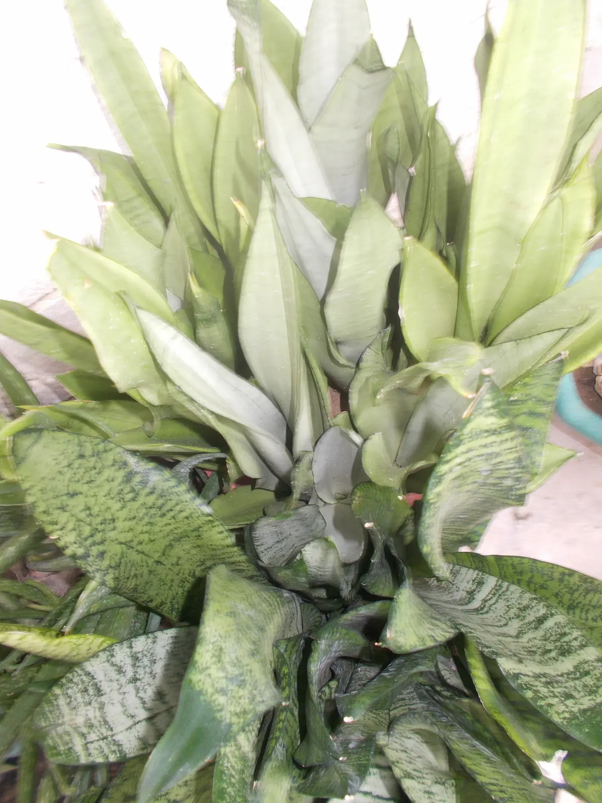
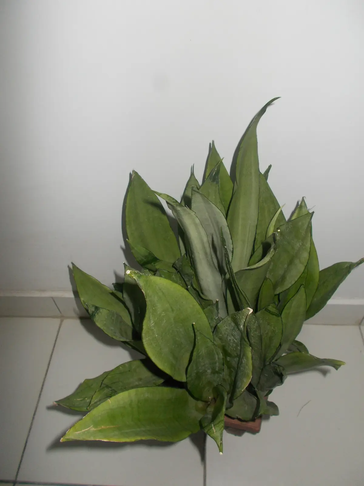

::: callout-note
### Affiliate Disclosure

As an Amazon Associate, I earn from qualifying purchases. If you buy a product through one of the links in this article, I may receive a small commission at no extra cost to you. I only recommend products I use myself or genuinely believe will add value to my readers.
:::

I've been growing plants since I was about nine years old. Over the years, I've learned just how much climate affects a plant's health. But when I started exploring indoor gardening, I quickly discovered that it comes with its own challenges. Space, safety around children and pets, and even your decorating style can affect which plants will thrive.

Even so, climate remains one of the most important factors. Plants that can handle a range of temperatures and humidities are far more likely to stay healthy throughout the year.

In this article, I share three houseplants that I've found to be reliable through every season and explain why they might be a good fit for your home.

## My Checklist for Choosing Hardy Houseplants

Before I buy a houseplant, I ask myself four questions:

1.  **Does it suit my home?**

    The first thing I consider is whether my home is a good fit for the plant.

    I live fairly minimally and love open, uncluttered spaces, so I naturally gravitate toward compact plants. Beautiful as they are, fast-growing trailing plants like the Devil's Ivy and large plants like Monstera deliciosa can quickly take over a room. Before long, your carefully planned living space may start to look like a mini jungle indoors. While some spaces totally rock the "mini-jungle" look, personally, I can't pull it off.

    I also think about my home's growing conditions. How much natural light comes in through the windows? Does the temperature within the room change much across seasons? What of the humidity? Is the air humid or dry? Is there enough airflow?

    Research shows that indoor plants thrive when their growing conditions match the conditions in their natural habitats, so all these questions are important. Good airflow, for example, can help mitigate the spread of pests and fungal diseases. For me, good airflow is important because I have contact dermatitis that flares up after exposure to plant pests like mealybugs and spider mites. As the saying goes, an ounce of prevention is worth a pound of cure.

    Before buying a plant, take note of your home's light, humidity, temperature, and airflow. Understanding the growing conditions within your home will help you choose plants that are suited to those conditions.

    **Helpful Tools**

    The following tools can help you assess your home's growing conditions:

    -   A light meter app on your smartphone can help you estimate how much light your house gets. Using such a tool, you can determine whether a spot gets low, medium, or bright light.

    -   If you're growing several houseplants, I'd consider getting a digital thermometer-hygrometer to monitor the temperature and humidity in your home. It can help you identify spaces that are consistently too hot, cold, dry, or humid for certain plants, making it easier to select the best plants to grow in different spaces. If you're looking for one, I'd recommend the [BALDR Indoor Thermometer Hygrometer](https://amzn.to/3Quobdo){target="_blank"} because it's easy to read and uses a solar-assisted design that can help extend battery life.

2.  **Does it fit my lifestyle?**

    I love gardening, but with so many things going on in my life, I know I might not always have time to spare. That's one reason I appreciate hardy plants. Many can tolerate the occassional missed watering or delayed pruning without complaining.

    Research also shows that houseplants do better when their care requirements match the time and attention their owners give them. A plant that fits your routine is more likely to stay healthy than one that doesn't. And a healthy plant usually means a happier owner too.

3.  **Is it safe for everyone at home?**

    This isn't something I personally think about because I don't have children or pets at home. But if you do, it's one of the first things you need to look into before bringing a new plant indoors.

    Children and pets are naturally curious. They may tug at trailing vines, dig into the potting mix, or chew leaves without you noticing. Some houseplants are mildly irritating if eaten, while others may be toxic. That's why horticultural experts recommend checking a plant's toxicity before introducing it into a home with children or pets.

    Safety doesn't stop with the plant itself. A heavy pot placed on a high shelf can cause serious injury if a child or pet pulls on trailing vines. Decorative pebbles placed on top of potting mixes may become choking hazards for children and pets. And fertilizers in the potting soil may be harmful if swallowed.

4.  **Will it stay healthy throughout the year?**

    Finally, I ask myself whether a plant can adapt to the changing conditions it will experience over the course of a year.

    In my current location, seasons are defined by changes in rainfall, sunlight, and humidity rather than by temperature. If you live in a temperate region, you may be more familiar with the distinct cycle of spring, summer, autumn, and winter. Either way, no home stays exactly the same throughout the year.

    Research shows that the most resilient houseplants are those that can tolerate diverse temperatures, humidity levels, and light conditions instead of requiring a perfectly stable environment. That's why I've chosen the plants in this article; they're among the most adaptable houseplants I've come across.

    To me, an all-season houseplant is one that adapts to the changing conditions in your home without becoming difficult to care for. Such plants are easier and more fun to grow in the long term.

## 3 Houseplants That Check All My Boxes

The three houseplants below meet all my requirements for an all-season indoor plant. They suit my lifestyle and adapt well to the seasons. While no houseplant is completely maintenance-free, these plants have earned a reputation for being the most resilient and beginner-friendly options available.

### Quick Comparison

```{=html}
<table>
  <thead>
    <tr>
      <th>Plant</th>
      <th>Best For</th>
      <th>Seasonal Advantage</th>
      <th>Maintenance</th>
      <th>Pet Safe?</th>
      <th>See Current Price</th>
    </tr>
  </thead>
  <tbody>
    <tr>
      <td>Spider Plant</td>
      <td>Beginners and families</td>
      <td>Recovers quickly from seasonal stress and inconsistent care</td>
      <td>Low</td>
      <td>Yes</td>
      <td><a href="https://amzn.to/43XdgvR" target="_blank">View on Amazon</a>
</td>
    </tr>
    <tr>
      <td>ZZ Plant</td>
      <td>Busy people</td>
      <td>Thrives even in very low-light rooms and tolerates long dry spells</td>
      <td>Very low</td>
      <td>No</td>
      <td><a href="https://amzn.to/442OKcD" target="_blank">View on Amazon</a></td>
    </tr>
    <tr>
      <td>Snake Plant</td>
      <td>Dry homes</td>
      <td>Handles dry indoor air and temperature changes very well</td>
      <td>Very low</td>
      <td>No</td>
      <td><a href="https://amzn.to/3QIb5t4" target="_blank">View on Amazon</a></td>
    </tr>
  </tbody>
</table>
```

### 1. Spider Plant

If you're looking for a forgiving plant that's difficult to kill, the spider plant is my top pick. It was one of the first plants I grew indoors, and although I eventually had to let it go because recurring mealybugs and spider mites became too much to manage in my humid home, I still consider it one of the best plants for beginners.

Research shows that spider plants grow best in moderate humidity (40%-60%) and temperatures between 60°F and 75°F. But they tolerate a much wider range of growing conditions, including humidity levels above 80%. Because they have thick roots that store nutrients and water, they can survive the occasional dry spell. Rather than watering on a schedule, I check that the top two inches of soil are dry before watering again.

**🌿 From My Garden**

Spider plants develop vigorous roots that can fill a pot surprisingly quickly. You'll know it's time to repot or divide the plant when you see thick roots growing out of the drainage holes.

**Helpful Pick:** If you're dividing or repotting your spider plant, a [sturdy set of nursery pots](https://amzn.to/3Quobdo){target="_blank"} makes the job much easier.

### 2. ZZ Plant

Another forgiving houseplant that thrives even when occasionally neglected is the ZZ plant. I love it especially because it does extremely well in low-light spaces, like my hallway upstairs where many other plants would struggle. Its thick, waxy leaves are also easy to keep clean, another reason it's one of my favorite indoor plants.

According to research, the ZZ plant thrives in temperatures between 60°F and 80°F and humidity levels of 40%-50%. Its thick underground rhizomes store water and nutrients, while its waxy leaves help reduce water loss, making it well adapted to dry indoor conditions. Because it grows slowly in an upward direction, it’s ideal for small spaces. But if you have children or pets, take care to place it out of their reach because it is mildly toxic if eaten.

**🌿 From My Garden**

I sometimes polish the leaves with the inside of a banana peel for an extra glossy shine. That's a hack I learned from [this article by The Guardian](https://www.theguardian.com/lifeandstyle/2025/nov/18/houseplant-hacks-can-you-use-banana-peel-to-shine-your-plants-leaves){target="_blank"}. Most of the time, I simply wipe the leaves with a damp microfiber cloth.

**Helpful Pick:** A [good microfiber towel](https://amzn.to/3QQQbI5){target="_blank"} makes it easy to keep the leaves of your ZZ plant clean and glossy. 

### 3. Snake Plant

::: {layout-ncol=2}



:::

::: {.caption style="text-align: center; color: gray;"}
My Snakies: Two Moonshines and a Zebra
:::

The snake plant is my absolute favorite houseplant in this list. In fact, I currently grow three varieties: Moonshine, Zebra, and Golden Edge.  
Although they're remarkably resilient, I've learned that overwatering is their biggest weakness, especially in my humid coastal climate where potting soil takes much longer to dry.

Research shows that snake plants thrive in temperatures between 60°F and 80°F and tolerate a wide range of humidity levels. Their thick, fleshy leaves store water, allowing them to cope well with dry indoor conditions and occasional missed waterings. They also grow upright to about 120 cm, making them great for smaller spaces. Like the ZZ plant, keep them out of reach of children and pets because they're toxic if ingested.


**🌿 From My Garden**

Because my home's humidity slows down soil drying, I use a soil moisture meter to know when to water instead of watering on a schedule. It has helped me avoid overwatering, one of the biggest causes of root rot in snake plants. 

**Helpful Pick:** A [soil moisture meter](https://amzn.to/4xX9u39){target="_blank"} takes the guesswork out of watering, especially if your home stays humid for much of the year.

## Final Thoughts

Every home experiences seasonal change, even if those seasons look different from one part of the world to another. Choosing a hardy, adaptable houseplant is one of the simplest ways to enjoy indoor greenery throughout the year.
