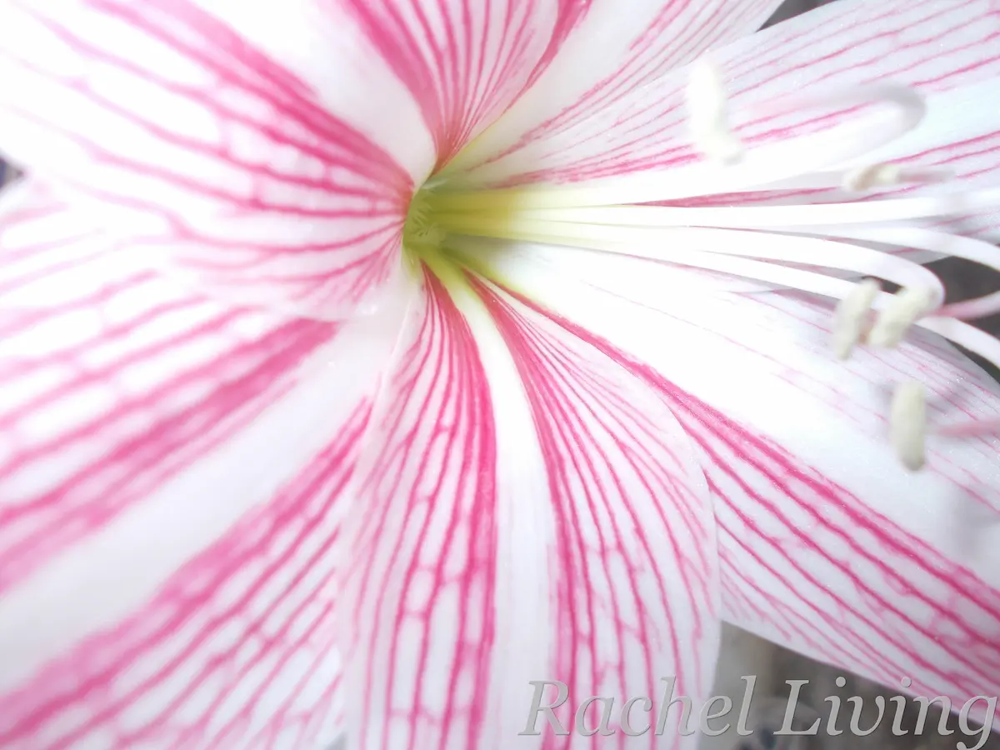
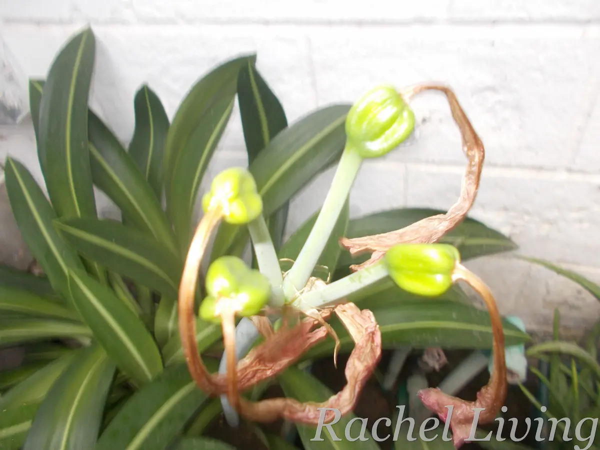
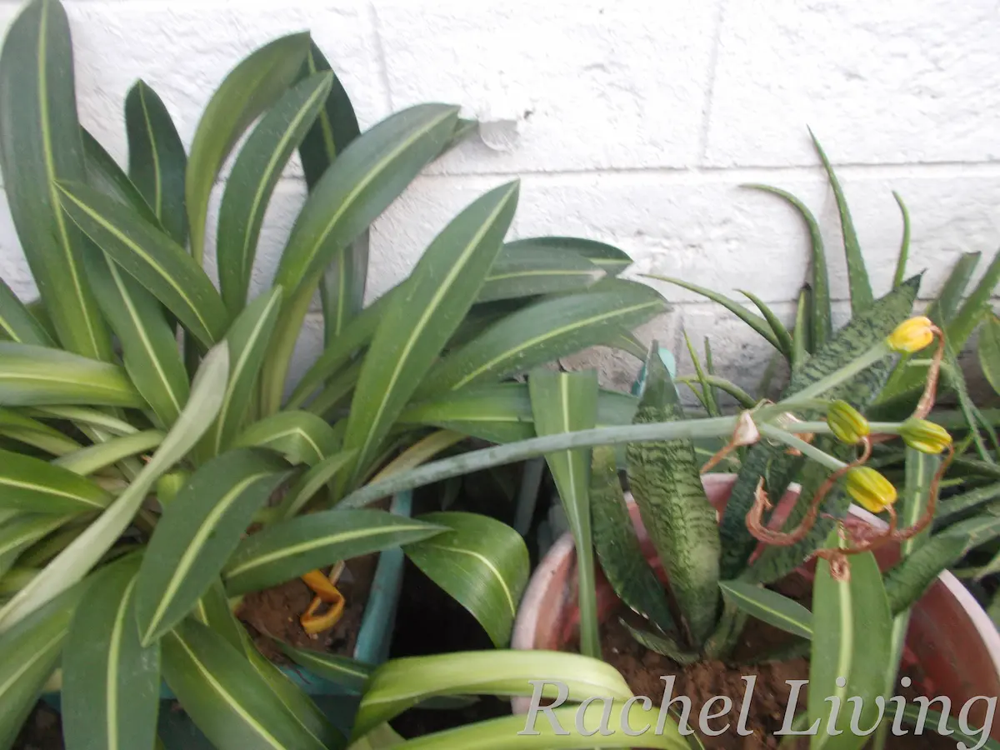

After posting a picture of my favorite variegated plant on the Reddit sub **r/VariegatedPlants**, several readers pointed out that what I thought was a Crinum was actually a Hippeastrum. Many thought it could be *H. reticulatum* or its hybrid, the much sought-after "Mrs Garfield." I later joined the Facebook group **Amaryllis and Hippeastrum Lovers**, where I learned a lot more about the plant I had already grown so fond of.

::: {layout-ncol="2"}
{width="60%"}

{width="60%"}
:::

::: grid-caption
My Hippy in bloom
:::

The mystery, however, wasn't quite solved. Was my Hippy really *H. reticulatum*, or could she be the elusive "Mrs Garfield?" Then I learned something that gave me an idea: if I could get her to accept her own pollen and produce viable seeds, perhaps those seeds would give me another clue.

## Could Self-Pollination Solve the Mystery?

I learned that Hippeastrums can be propagated from bulbs or seeds. I'd used the bulb method many times before, but I'd never grown one from seed. So, naturally, I started looking into it.

That's when things got interesting. I discovered that I could hand-pollinate my Hippy using its own pollen, or pollen from another Hippeastrum. But there was a snag. If my plant was "Mrs Garfield," getting it to produce seeds from its own pollen could be difficult because this hybrid is known for being largely seed-sterile.

Interesting, right?

*H. reticulatum*, on the other hand, plays by different rules. It is self-fertile, meaning it can produce seeds when pollinated with its own pollen. But even then, the resulting seedlings may not look exactly like their parent. Some can lose the variegation, while others may develop quite different foliage and overall appearance.

Suddenly, my little pollination experiment seemed like it could be more than just a way to grow some new Hippeastrums. It could also give me another clue about what my Hippy actually is.

## Now We Wait

I went ahead and self-pollinated my Hippy to see what would happen.

As I write this, the seed pods have swelled beautifully. I still don't know whether they'll actually produce viable seeds, but so far, things are looking promising. In the beginning, the pods were round and green. Now, they're slowly turning yellowish as they mature.

::: {layout-ncol="2"}
{width="60%"}

{width="60%"}
:::

::: grid-caption
Watching the seed pods mature
:::

I'll wait for them to open so I can harvest the seeds. Hopefully, they'll give me another clue about whether my Hippy is "Mrs Garfield" or *H. reticulatum*. For now, I'll just enjoy the anticipation, the sturdy flower stalk, and those slowly yellowing pods.

See you soon for the reveal! 😊

