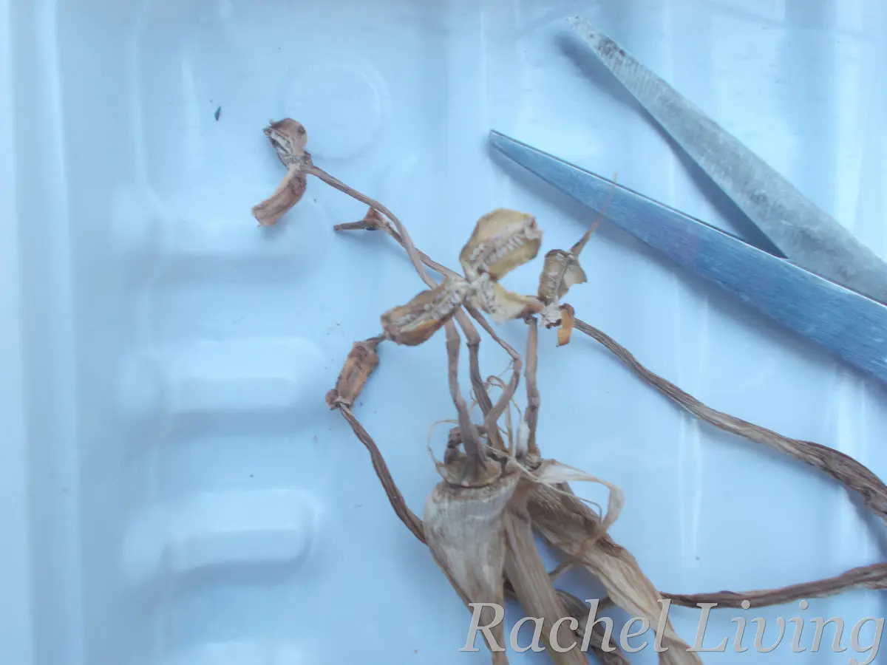
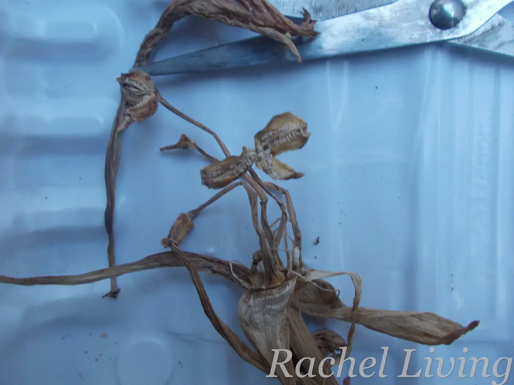
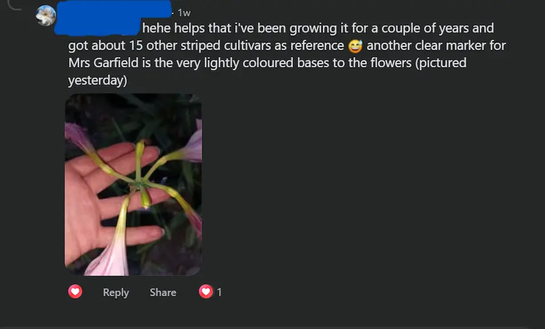
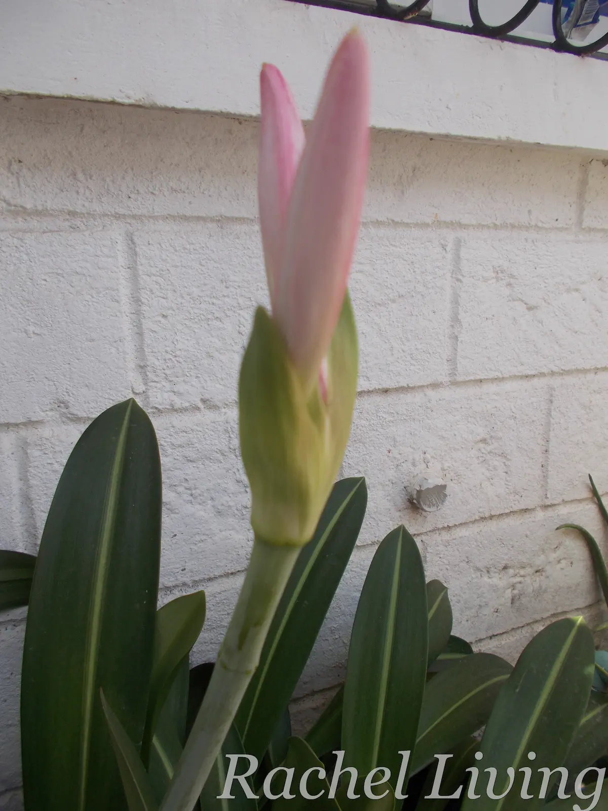

Remember the mystery Hippeastrum I decided to self-pollinate to see if I could finally find out whether it’s a *H. reticulatum* or a Mrs Garfield? Well, I may have gotten somewhere with that [small experiment ](can-my-mystery-Hippeastrum-reveal-its-identity.qmd){target="_blank"}. 

I was excited when I saw the pods swell. Although my Hippy had flowered many times before, I’d never seen its pods swell. So, I thought I was off to a good start. A week or two later, though, the pods stopped expanding and started to yellow. Several days later, I came home to find that they had completely dried up.

Anyhow, I cut them off the plant using a pair of scissors. I then split the pods open to see if they had any seeds, but no. No seeds popped out.

::: {.photo-pair}

:::

::: grid-caption
Shriveled seed pods
:::

## Back to my Hippeastrum support group

To be frank, I was a little disappointed. I was hoping for seeds. But then I got to thinking: perhaps the absence of seeds was actually another clue that my Hippy could be a Mrs Garfield.

So, I headed over to the **Amaryllis/Hippeastrum Lovers & Enthusiasts** Facebook group and posted the results of my self-pollination experiment.

I love this group because it never lets you down when it comes to advice and inspiration. As luck would have it, I came across a grower with a range of Hippeastrum cultivars, including Mrs Garfield. Looking at my pictures, he advised that my plant was certainly not a pure *H. reticulatum*.

He then shared a photo of his Mrs Garfield with me and pointed out that the flowers of this cultivar have lightly colored bases (see a screenshot of our chat below). He also agreed that the cultivar appeared to be self-sterile, as he'd had similar results when he tried to self-pollinate his plants. 

{width="60%"}

## So, Have I Solved the Mystery?

I left that conversation a little more confident that my plant was likely a Mrs Garfield. As I write this post, it's flowering, so I intend to look more closely at the bases of its flowers this time around and see whether they have the same lightly colored appearance the grower pointed out to me.

{width="60%"}

Otherwise, shall we say I've moved on? 😊 I love my Mrs Garfield.

