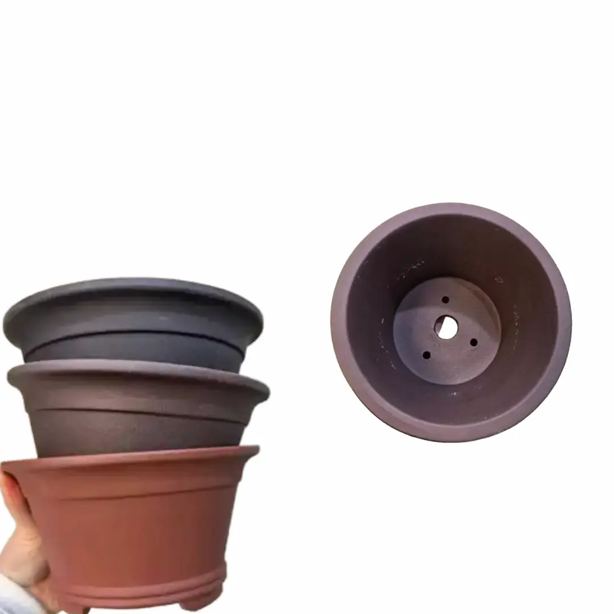
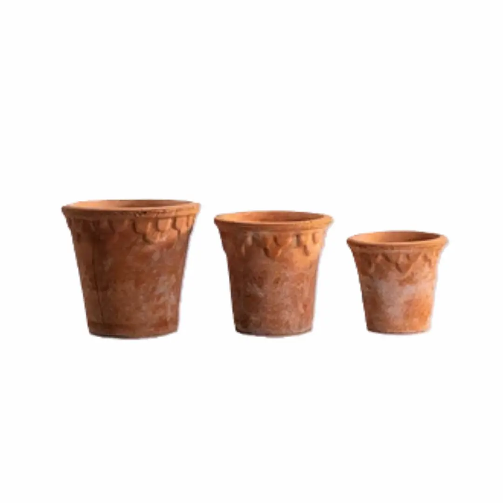
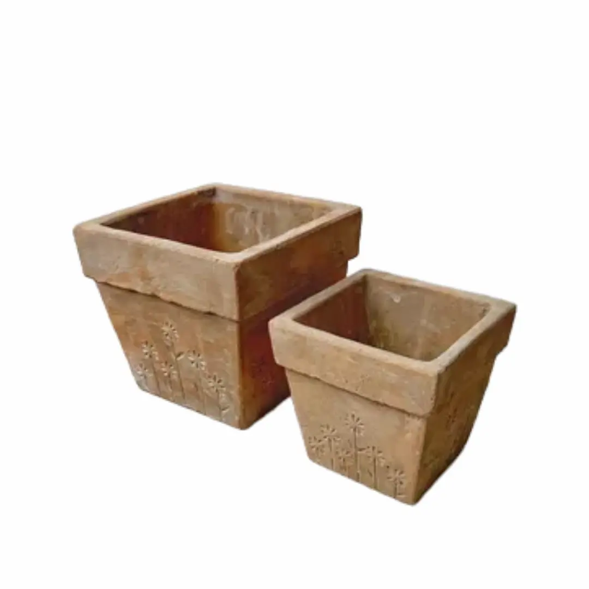
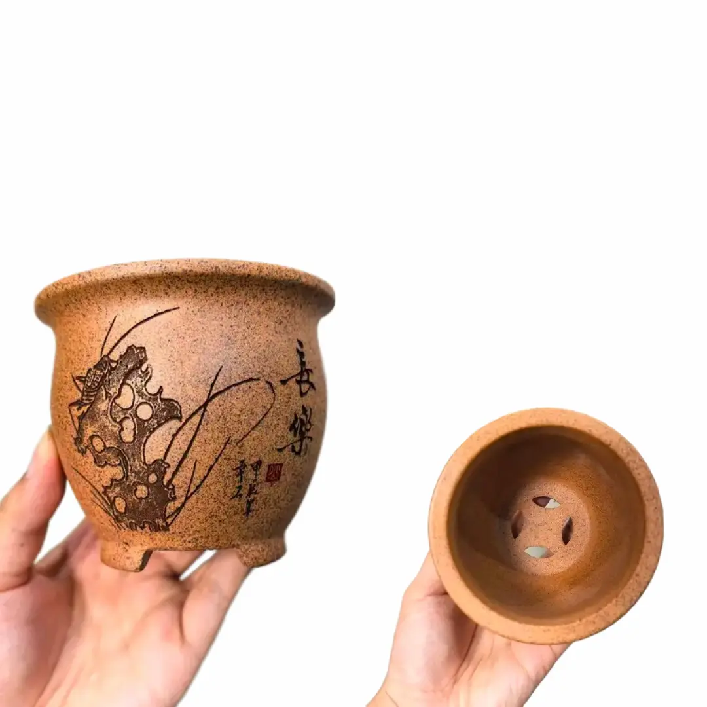
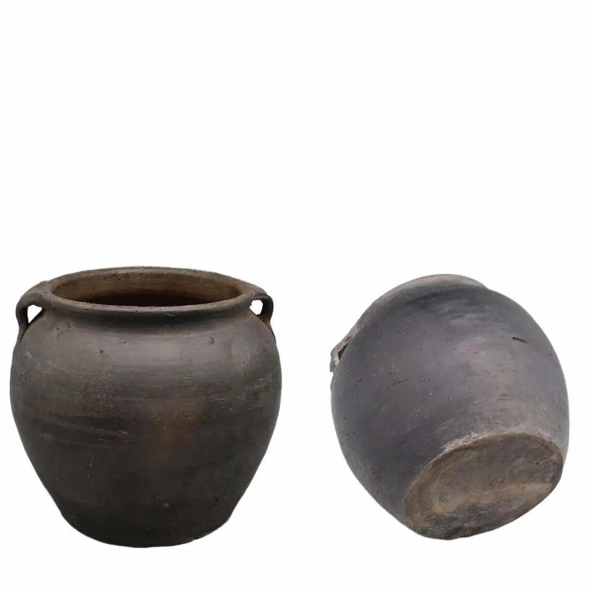
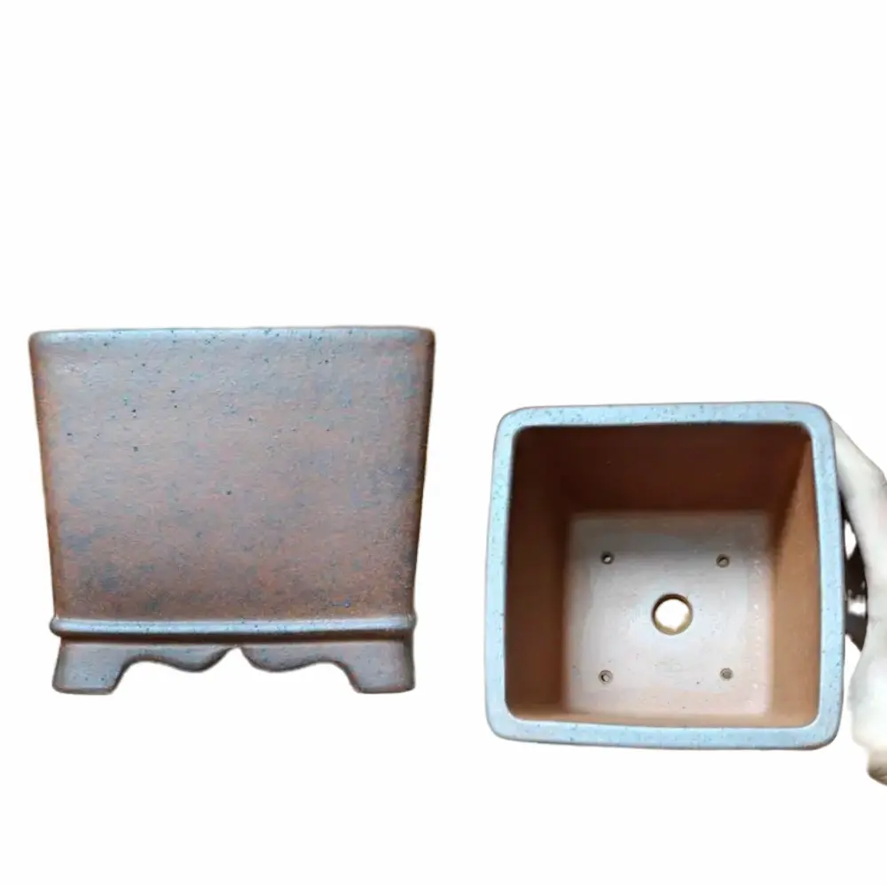
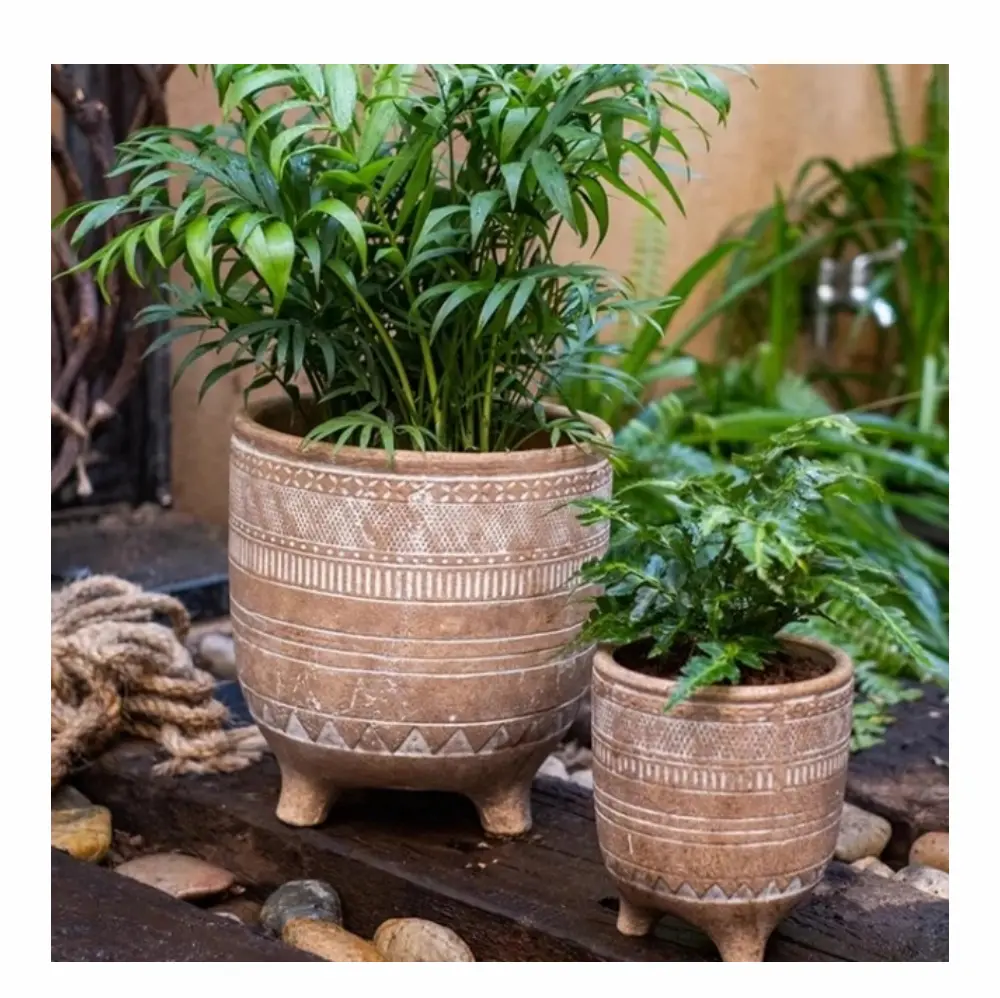

For this shopping trip, I focused on unglazed clay pots and planters. They offer growing conditions that are surprisingly close to the natural environments many plants evolved in. Unlike their attractive glazed ceramic cousins, they are porous, allowing excess moisture to evaporate through the clay while improving airflow around the root zone. Together, these qualities can encourage healthier roots and even help keep the root zone a little cooler in warm weather.   

It wasn't very easy finding unglazed clay pots and planters on AliExpress. My first search turned up several beautiful pots, but they all came from one shop called Yi Xing Green Pots Store. I soon discovered that Yixing is actually a renowned style of unglazed pottery crafted from Zisha (purple sand) clay, named after its place of origin in Yixing, China.

To find more variety, I broadened my search using terms like *terracotta plant pot* and *unglazed ceramic planter*. These are the seven pots and planters that stood out to me.

## Yixing Round Bonsai Pot

{width="60%"}

The [Yixing Round Bonsai Pot (#ad)](/go/yixing-round-bonsai-pot){target="_blank"} made it here because it checked off most of the boxes on my pot list. Box one: it is made from porous, unglazed Zisha clay. Plants that hate wet feet will love that. Think small bonsai trees, succulents, snake plants, and Mediterranean herbs like thyme and sage. 

Box two: like many other bonsai pots, it has large drainage holes and sturdy feet that raise the pot off the surface, allowing air to circulate underneath and keeping the drainage holes clear.

And three, it looks awesome in all three shades: black, purple, and red. The matte finish gives it an earthy, softly sophisticated look that's both calming and welcoming.

## Retro Red Clay Flower Pot

{width="60%"}

It was the look of [this pot by XinZhengYan (#ad)](/go/red-clay-flower-pot){target="_blank"} that caught my eye. I love its weathered, rough, and uneven appearance.  Its depth too makes it great for plants with deep root systems. 

You have the option of buying the pot singly or in sets, as it is available in several sizes. The porous clay walls are an additional bonus, helping excess moisture escape and reducing the chances of roots sitting in soggy soil.

With these features in mind, I'd choose this pot for deep-rooted succulents like large aloes and desert roses, as well as Mediterranean herbs.

## Vintage Clay Flower Pots with a Daisy Pattern

{width="60%"}

[These tapered square pots (#ad)](/go/vintage-clay-pot-with-daisy-pattern){target="_blank"} caught my eye because they offer something a little different from the usual round terracotta pot. I especially love the daisy motif etched around the lower part of each pot and the fact that they come as a pair, with one larger than the other.

At about 22 cm deep, the larger pot could be a good home for a dwarf citrus tree or a small patio shrub. The smaller one would be perfect for bushy kitchen herbs like parsley that need some vertical root space but hate wet feet.

The pots are sold by Lina Handcrafter Store, and the listing photos show drainage holes at the bottom. 

## Yixing Gold Clay Pot

{width="60%"}

Another unglazed pot I couldn't let pass by from Yixing Green Pots Store is the [Yixing Gold Clay Pot (#ad)](/go/yixing-gold-clay-pot){target="_blank"}. This one is made from Zisha, or purple clay, and features a hand-carved design on its face. Its shape reminds me of an elegant, flared teacup, complete with sturdy legs, a rolled rim, and drainage holes. The legs raise the base off the ground, helping keep the drainage holes clear and allowing excess water to escape.

At just 9.6 × 9.6 × 9.6 cm, it holds very little soil, so I'd reserve it for small plants like Haworthia cooperi or Lithops. These little guys don't need a huge pot, and honestly, putting them in one would be asking for trouble.

## Black Clay Pot 

{width="60%"}

[This black clay pot by Eastern Tide Homer Furnishing (#ad)](/go/black-clay-pot){target="_blank"} features a broad belly, a flared rim, and two handles on opposite sides. I love its old-pot aesthetic, which would fit right into a rustic or antique-style setting.

Honestly, this is the kind of pot I'd use to cook fresh, sweet tilapia over a smoky fire in a little hut in rural Africa. You know the kind of pot I'm talking about. 😉

The one downside is that the listing photos don't show any drainage holes. Perhaps that's why the seller presents it as a flower vase. But if you're comfortable drilling pottery, and the seller confirms that the pot can be drilled, you could add one or two drainage holes and turn it into a rather handsome planter. I'd use it for a cascading houseplant like a pothos or philodendron.

## Square Gold Clay Bonsai Pot

{width="60%"}

So far, all the pots I've picked from Yixing Green Pots have passed my drainage test, and the [Square Gold Clay Pot (#ad)](/go/square-gold-clay-bonsai-pot){target="_blank"} is no exception. It has four small drainage holes and one large one on the bottom. With an internal depth of about 9 cm, I'd use it for a small, dry-feet-loving succulent like Haworthia or a young bonsai trained in a cascading style.

One more thing I like about this listing is the seller. Yixing Green Pots has a high rating and had 392 items sold at the time of writing this article. That's always reassuring when shopping for handmade or fragile items online.

## Prague Terracotta Footed Pot

{width="60%"}

I thought this [Prague Terracotta Footed Pot (#ad)](/go/prague-terracotta-footed-pot){target="_blank"} was the perfect one to end the list with, adding a distinct, textured, handcrafted look. Its barrel-shaped, patterned body and rounded feet make it look like a decorative drum from another era.

The listing says it's made from terracotta clay and comes with one drainage hole at the bottom. The drainage hole and raised feet are a plus for plants that don't like sitting in wet soil, such as kitchen herbs and small snake plants.

At less than \$10, the smaller version is the most budget-friendly pot on this list. At the time of writing, it costs \$7.92, while the larger version is \$21.78. The store selling it, Shop1104102675 Store, also has a very high seller rating, which is another point in its favor.

## Make Your Pick

I think they're all great pots, really, but the best one for you depends on what you want to grow. I've included a mix of large and small pots, so hopefully there's something here that catches your eye and suits your plants.

I hope you find one you love. See you soon on my next shopping trip. Cheers!
