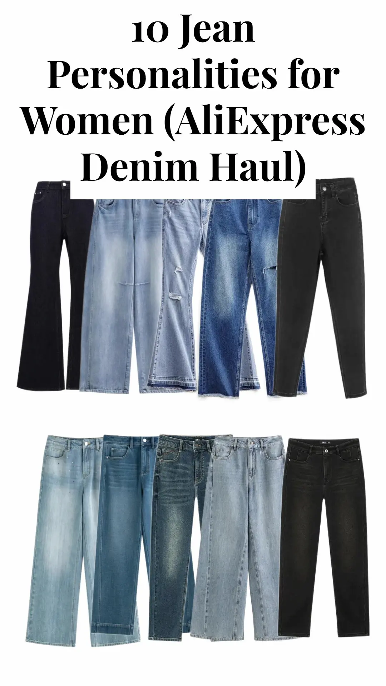

::: {.callout-note appearance="simple"}
## Affiliate Disclosure

This article contains affiliate links. If you purchase through one of them, I may earn a small commission at no extra cost to you.
:::

## Watch the Video

::: {style="max-width: 320px; margin: 0 auto 2rem auto; text-align: center;"}

{target="_blank"}

**▶ Watch on YouTube**

:::

I recently lost some weight and thought it was time to sort through my wardrobe, especially my jeans because, boy, don't I have a big collection! I have a pair of white straight-leg jeans with sequin-embellished back pockets that I've only worn once or twice, if I remember correctly. Then there's the cropped wide-leg culotte jeans that I absolutely love wearing to the farmers' market. And then there's the boyfriend jeans, the jeggings, the frayed-hem jeans. Sigh. So many!

And that got me thinking: why not do a Short featuring a range of jean personalities from some of my finds on AliExpress? Check them out below.

## Sleek

::: {.shop-list}
- [Skinny Jeans](/go/skinny-chic-ven-jeans){.shop-link target="_blank"}\
  CHIC VEN Official Store
:::

## Effortless

::: {.shop-list}
- [Wide-Leg Jeans](/go/wide-leg-dushu-jeans){.shop-link target="_blank"}\
  DUSHU Official Store
:::

## Modern

::: {.shop-list}
- [Barrel-Leg Jeans](/go/barrel-leg-dushu-jeans){.shop-link target="_blank"}\
  DUSHU Official Store
:::

## Polished

::: {.shop-list}
- [Tapered Denim](/go/tapered-semir-denim){.shop-link target="_blank"}\
  Semir Official Store
:::

## Relaxed

::: {.shop-list}
- [Cropped Straight-Leg Jeans](/go/straight-leg-dushu-jeans){.shop-link target="_blank"}\
  DUSHU Official Store
:::

## Feminine

::: {.shop-list}
- [Flared Jeans](/go/flared-amii-jeans){.shop-link target="_blank"}\
  AMII Official Store
:::

## Retro

::: {.shop-list}
- [Ripped Bell-Bottom Jeans](/go/ripped-bell-bottom-jeans-maden){.shop-link target="_blank"}\
  MADEN Women Wear Store
:::

## Edgy

::: {.shop-list}
- [Ripped Denim Jeans](/go/ripped-denim-jeans-maden){.shop-link target="_blank"}\
  MADEN Women Wear Store
:::

## Rebel

::: {.shop-list}
- [Distressed Straight-Leg Jeans](/go/straight-leg-semir-jeans){.shop-link target="_blank"}\
  Semir Official Store Store
:::

## Glam

::: {.shop-list}
- [Rhinestone Straight-Leg Jeans](/go/rhinestone-straight-leg-dushu-jeans){.shop-link target="_blank"}\
  DUSHU Official Store Store
:::

## Which One Would You Pick?

With this many personalities to choose from, I might have just made my jeans problem worse. 😄

Cheers!
