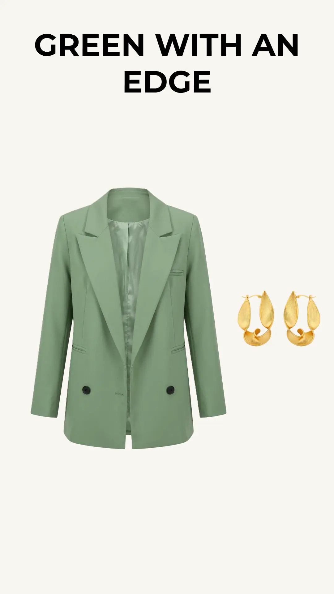

::: {.callout-note appearance="simple"}
## Affiliate Disclosure

This article contains affiliate links. If you purchase through one of them, I may earn a small commission at no extra cost to you.
:::

## Watch the Video

::: {style="max-width: 320px; margin: 0 auto 2rem auto; text-align: center;"}

**▶ Watch on YouTube**
:::

I love green. I have a few green tops that I like to wear with black pants or jeans. But I'm realizing that I need a few more green pieces in my wardrobe.
Green is a great neutral that works with almost every other color. Plus, you can play around with its many shades to create an all-green outfit. I tend to shy away from louder shades like neon and lime because I find them a little too aggressive for my introverted personality. But while putting this piece together, I discovered that even these shades can work quite well for me when they're dialed down a tad.
So, here are my three all-green looks for today.

## Look 1: The Wayward Scholar

I paired the light olive blazer with a lime-green pussy-bow blouse to create this relatively restrained look, then let the edgy leather mini skirt shake things up a bit. The different textures work well together, making the outfit feel exciting rather than commonplace.

::: shop-list
- [Light olive-green tailored blazer with two black buttons: ](/go/olive-green-tailored-blazer){.shop-link target="_blank"}\
  [LARGE SIZE-01 Store]{.shop-store}
  
- [Lime pussy-bow blouse](/go/lime-pussy-bow-blouse){.shop-link target="_blank"}\
  [SFELIKY China Silk Official Store]{.shop-store}
  
- [Dark-green leather mini skirt](/go/dark-green-leather-mini-skirt){.shop-link target="_blank"}\
  [Tajiyane Official Store]{.shop-store}
  
- [Dark-green stiletto boots](/go/dark-green-stiletto-boots){.shop-link target="_blank"}\
  [BOLSACHY Store]{.shop-store}
  
- [Twisted hoop earrings](/go/twisted-hoop-earrings){.shop-link target="_blank"}\
  [VAROLE Jewelry Official Store]{.shop-store}
:::

## Look 2: The Green Architect

I paired the tailored blazer with straight-leg pants and sock boots to give the outfit that sleek, structured look I was after. Then I added the corset, oversized mint shirt, and irregular hoop earrings for a touch of eccentricity.  

::: shop-list
- [Light olive-green tailored blazer with two black buttons: ](/go/olive-green-tailored-blazer){.shop-link target="_blank"}\
  [LARGE SIZE-01 Store]{.shop-store}
  
- [Forest-green steampunk corset](/go/forest-green-steampunk-corset){.shop-link target="_blank"}\
  [guang zhou shiley sexy lingerie Store]{.shop-store}
  
- [Mint-green button-down shirt](/go/mint-green-button-down-shirt){.shop-link target="_blank"}\
  [Shop1105635881 Store]{.shop-store}
  
- [Deep-olive straight pants](/go/deep-olive-straight-pants){.shop-link target="_blank"}\
  [Willshela Official Store]{.shop-store}
  
- [Dark-green sock boots](/go/dark-green-sock-boots){.shop-link target="_blank"}\
  [MCDV Shoe Store]{.shop-store}
  
- [Twisted hoop earrings](/go/twisted-hoop-earrings){.shop-link target="_blank"}\
  [VAROLE Jewelry Official Store]{.shop-store}
:::

## Look 3: Green With an Attitude

For a sharp and confident look, I layered the blazer over a chartreuse form-fitting top and a leather midi skirt with an asymmetrical hem. The dramatic slit shows off a little leg and gives the outfit some extra attitude. The snakeskin boots are just what's needed to break up the monochromatic look and take that attitude a little further.

::: shop-list
- [Light olive-green tailored blazer with two black buttons: ](/go/olive-green-tailored-blazer){.shop-link target="_blank"}\
  [LARGE SIZE-01 Store]{.shop-store}
  
- [Round-neck long-sleeve top in a chartreuse hue](/go/chartreuse-round-neck-top){.shop-link target="_blank"}\
  [FANSILANEN Store]{.shop-store}
  
- [Forest-green asymmetrical leather skirt](/go/forest-green-asymmetrical-leather-skirt){.shop-link target="_blank"}\
  [Dazzin Store]{.shop-store}
  
- [Dark-green knee-high snakeskin boots](/go/dark-green-knee-high-snakeskin-boots){.shop-link target="_blank"}\
  [Shop2762011 Store]{.shop-store}
  
- [Twisted hoop earrings](/go/twisted-hoop-earrings){.shop-link target="_blank"}\
  [VAROLE Jewelry Official Store]{.shop-store}
:::

## Which Green Would You Wear?

Me, I love everything here. The heels on the boots might be a little problematic for me, sigh! I miss the younger me. But as long as I'm not walking miles in them, I'd definitely keep them.

Anyhow, I made these looks for you and me. So, pick your poison! 😊
